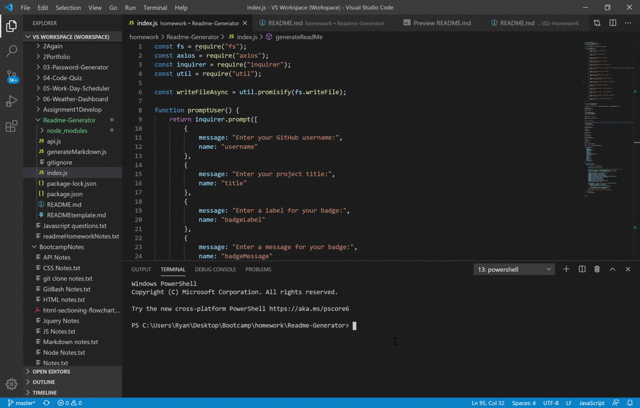

# README Generator


    
## Description
This application takes user input and generates a README.md file. If the user does not enter any information, the generated README will contain a heading for the corresponding section, which the user can fill in or delete later. The application also runs a call to the github API and returns the user's profile picture and bio information.
    
### User Story
```
AS a developer
I WANT a simple readme generator 
SO THAT I can easily generate good readme's for my projects
```
    
### Acceptance Criteria

* A functional application
* That generates a README.md file, including a profile picture and email based on user input
* The README must contain a badge
* The README must contain the following sections:
  * Title
  * Description
  * Table of Contents
  * Installation
  * Usage
  * License
  * Contributing
  * Tests
  * Questions
    
## Usage 
This application must be run with the following command:
```
node index.js
```

## Gif Showing Application Functionality


## Picture of me

